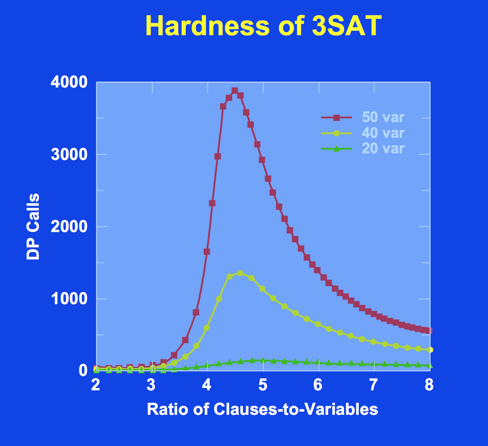

# DPLL BASED SAT SOLVER


Boolean satisfiability problem is the problem of determining whether there is at least one valuation that satisfies the given boolean formula or not. Satisfiability solving algorithms has been widely studied for years. The problem is very important because it is the first problem that proved to be NP-complete. Instead of solving NP problems, those problems are reduced and solved by SAT solvers. 

SAT-Solvers are used for various applications in different domains such as model checking, combinatorial design, test pattern generation and so on. SAT Solvers developed in last twenty years significantly improved the performance and nowadays we have efficient SAT-Solvers. These modern SAT-Solvers are mainly based on two different algoritm. First is Conflict-Driven Clause learning algorithm which is a variant of Davis Putnam Logemann Loveland(DPLL) algorithm and second is stochastic local search algorithm. However stochastic local search algorithm is incomplete and returns an answer for some satisfiable formulas and may run forever for unsatisfiable formulas. 

###DPLL

In this repository, I developed a DPLL-based SAT Solver algorithm just for demonstration. SATSolver algorithm is implemented under com.mobcom.solver package, file read and write processes are handled in com.mobcom.common package.

DPLL algorithms are based on three main steps which are pure literal elimination, unit propagation and choosing new literal for branching.

* Pure literal term refers that a literal l appears in some clauses but complement of it does not appear in any clause. Pure literal elimination is done by deleting every clause containing pure literal. Eliminated literals are assigned as true in this process.([com.mobcom.solver.DPLLService.eliminatePureLiteral](src/main/java/com/mobcom/solver/DPLLService.java))

* Unit clause term defines a clause that consists of exactly one literal. Unit clause can only be satisfied by assigning necessary value to make unit literal true. By making unit clause true, we can remove every clauses containing this literal, also complement of this literal cannot make a clause true anymore. Therefore complement of this literal is removed from remaining clauses ([com.mobcom.solver.DPLLService.doPropagation](src/main/java/com/mobcom/solver/DPLLService.java)). Unit propagation rule may lead to a conflict. At this step, DPLL algorithm performs backtracking to immediate level and makes a forced assignment. 

* DPLL algorithm performs unit propagation and pure literal elimination as much as possible at the beginning. If no clauses are left then the given formula is satisfiable. If there is an empty clause, it means that assignments are leading us to a contradiction at the root level. Therefore the given formula is unsatisfiable. If satisfiability of the given formula cannot be determined at the beginning, DPLL algorithm starts to make decisions and performs unit propagation. If it leads to a conflict, algorithms backtracks to the immediate level and choose complement of earlier decision. In this way, DPLL eventually reaches to a conclusion about the satisfiability of the given formula.


### Running SAT Solver

```sh
mvn package
```

This command will generate SATSolver.jar.

##### To run the program on SAT problems
```sh
java -jar SATSolver.jar "problem.cnf" "problem.sol"
```
First parameter is input file and the second parameter is the result file. If the problem is not satisfiable then result file will be empty. 

### Examples

Resource folder contains 12 sample problems and application can be run by just giving file names for those problem files. Otherwise you need to give absolute path to the application.

The solutions for satisfiable problems are as follows:

* [problem1.sol](problem1.sol) 
* [problem2.sol](problem2.sol)
* [problem3.sol](problem3.sol)
* [problem4.sol](problem4.sol)
* [problem5.sol](problem5.sol)
* [problem6.sol](problem6.sol)
* [problem8.sol](problem8.sol)
* [problem9.sol](problem9.sol)
* [problem11.sol](problem11.sol)
* [problem12.sol](problem12.sol)

Problem 7 and 10 are not satisfiable.


### Results

Problem       | File Read (s) | Solver (s)    | Total Time (s) | Number of Variables  | Number of Clauses   | Clauses/Variables Ratio  
------------- | ------------- | ------------- | -------------  | -------------      | -------------         | -------------         
problem1      | 0.09          | 0.04          | 0.13           | 20                 | 91                    | 4.55                   
problem2      | 0.09          | 0.03          | 0.12           | 50                 | 80                    | 1.6                   
problem3      | 0.10          | 0.18          | 0.28           | 100                | 340                   | 3.4                   
problem4      | 0.11          | 0.97          | 1.08           | 200                | 680                   | 3.4                   
problem5      | 0.10          | 0.08          | 0.18           | 200                | 320                   | 1.6              
problem6      | 0.09          | 0.12          | 0.21           | 50                 | 100                   | 2                   
problem7      | 0.09          | 0.07          | 0.16           | 50                 | 100                   | 2                   
problem8      | 0.1           | 0.06          | 0.16           | 50                 | 300                   | 6                   
problem9      | 0.1           | 0.09          | 0.19           | 100                | 200                   | 2                   
problem10     | 0.1           | 0.23          | 0.33           | 100                | 200                   | 2                   
problem11     | 0.11          | 0.08          | 0.19           | 100                | 600                   | 6                   
problem12     | 0.12          | 0.69          | 0.81           | 200                | 1200                  | 6                  

As shown in table, it seems that number of variables affects the solving time if the ratio of clauses to variables remains same.
It seems that if the number of clauses remains same, the time it takes to solve each problem decrease as the number of variables increases. The time it takes to solve problem 8 is about half the time it takes to solve problem 6. But actually this is not true, hardness of 3-Sat is depicted in the following figure (SAT-Solving: From Davis Putnam to Zchaff and Beyond):



### References

* [DPLL Algorithm] (https://en.wikipedia.org/wiki/DPLL_algorithm)
* [SAT-Solving: From Davis Putnam to Zchaff and Beyond] (http://ed.ac.uk/teaching/courses/propm/papers/Zhang/sat_course1.pdf)

              
